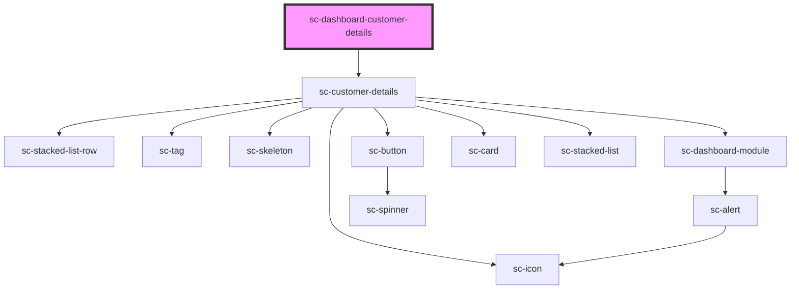

# ce-customer-details

<!-- Auto Generated Below -->

## Properties

| Property     | Attribute     | Description | Type     | Default     |
| ------------ | ------------- | ----------- | -------- | ----------- |
| `customerId` | `customer-id` |             | `string` | `undefined` |
| `heading`    | `heading`     |             | `string` | `undefined` |

## Dependencies

### Depends on

- [sc-customer-details](../../../ui/customer-details)

### Graph

----------------------------------------------

*Built with [StencilJS](https://stenciljs.com/)*
