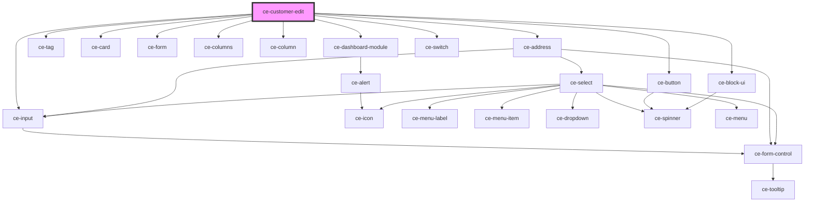

# ce-customer-edit

<!-- Auto Generated Below -->

## Properties

| Property     | Attribute     | Description | Type       | Default     |
| ------------ | ------------- | ----------- | ---------- | ----------- |
| `customer`   | --            |             | `Customer` | `undefined` |
| `heading`    | `heading`     |             | `string`   | `undefined` |
| `successUrl` | `success-url` |             | `string`   | `undefined` |

## Dependencies

### Depends on

- [ce-dashboard-module](../../../ui/dashboard-module)
- [ce-tag](../../../ui/tag)
- [ce-card](../../../ui/card)
- [ce-form](../../../ui/form)
- [ce-input](../../../ui/input)
- [ce-columns](../../../ui/columns)
- [ce-column](../../../ui/column)
- [ce-address](../../../ui/address)
- [ce-switch](../../../ui/switch)
- [ce-button](../../../ui/button)
- [ce-block-ui](../../../ui/block-ui)

### Graph

----------------------------------------------

*Built with [StencilJS](https://stenciljs.com/)*
