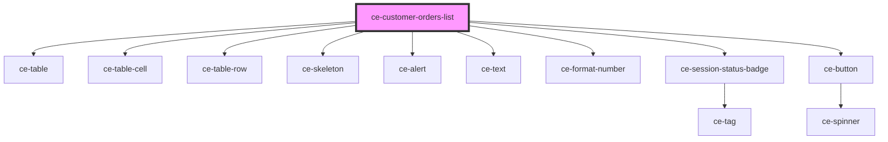

# ce-customer-subscriptions-list

<!-- Auto Generated Below -->

## Properties

| Property     | Attribute     | Description                        | Type     | Default     |
| ------------ | ------------- | ---------------------------------- | -------- | ----------- |
| `customerId` | `customer-id` | Customer id to fetch subscriptions | `string` | `undefined` |
| `page`       | `page`        |                                    | `number` | `undefined` |

## Dependencies

### Depends on

- [ce-table](../../../ui/table)
- [ce-table-cell](../../../ui/table-cell)
- [ce-table-row](../../../ui/table-row)
- [ce-skeleton](../../../ui/skeleton)
- [ce-alert](../../../ui/alert)
- [ce-text](../../../ui/text)
- [ce-format-number](../../../util/format-number)
- [ce-session-status-badge](../../../ui/session-status-badge)
- [ce-button](../../../ui/button)

### Graph

----------------------------------------------

*Built with [StencilJS](https://stenciljs.com/)*
