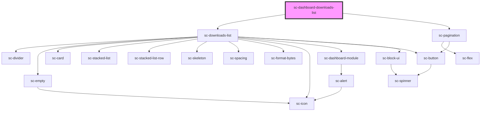

# ce-customer-subscriptions-list

<!-- Auto Generated Below -->

## Properties

| Property       | Attribute       | Description                        | Type                                  | Default                                |
| -------------- | --------------- | ---------------------------------- | ------------------------------------- | -------------------------------------- |
| `allLink`      | `all-link`      |                                    | `string`                              | `undefined`                            |
| `heading`      | `heading`       |                                    | `string`                              | `undefined`                            |
| `query`        | --              | Customer id to fetch subscriptions | `{ page: number; per_page: number; }` | `{     page: 1,     per_page: 10,   }` |
| `requestNonce` | `request-nonce` |                                    | `string`                              | `undefined`                            |

## Dependencies

### Depends on

- [sc-downloads-list](../../../ui/downloads-list)
- [sc-pagination](../../../ui/pagination)

### Graph

----------------------------------------------

*Built with [StencilJS](https://stenciljs.com/)*
