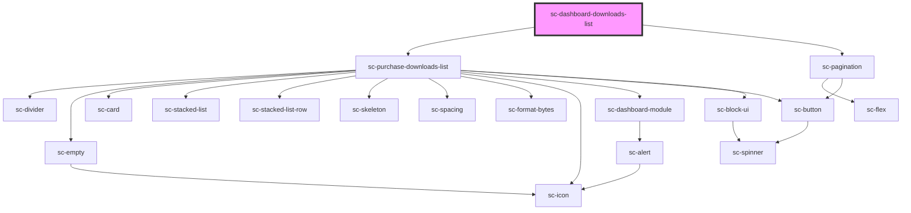

# ce-customer-subscriptions-list

<!-- Auto Generated Below -->

## Properties

| Property       | Attribute       | Description                        | Type      | Default                                |
| -------------- | --------------- | ---------------------------------- | --------- | -------------------------------------- |
| `allLink`      | `all-link`      |                                    | `string`  | `undefined`                            |
| `heading`      | `heading`       |                                    | `string`  | `undefined`                            |
| `isCustomer`   | `is-customer`   |                                    | `boolean` | `undefined`                            |
| `query`        | `query`         | Customer id to fetch subscriptions | `any`     | `{     page: 1,     per_page: 10,   }` |
| `requestNonce` | `request-nonce` |                                    | `string`  | `undefined`                            |

## Dependencies

### Depends on

- [sc-purchase-downloads-list](../../../ui/purchase-downloads-list)
- [sc-pagination](../../../ui/pagination)

### Graph

----------------------------------------------

*Built with [StencilJS](https://stenciljs.com/)*
