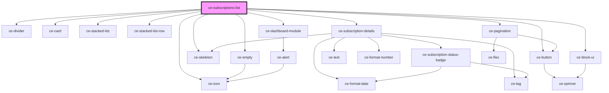

# ce-customer-subscriptions-list

<!-- Auto Generated Below -->

## Properties

| Property         | Attribute         | Description                        | Type                                  | Default                                |
| ---------------- | ----------------- | ---------------------------------- | ------------------------------------- | -------------------------------------- |
| `allLink`        | `all-link`        |                                    | `string`                              | `undefined`                            |
| `cancelBehavior` | `cancel-behavior` |                                    | `"immediate" \| "period_end"`         | `'period_end'`                         |
| `heading`        | `heading`         |                                    | `string`                              | `undefined`                            |
| `query`          | --                | Customer id to fetch subscriptions | `{ page: number; per_page: number; }` | `{     page: 1,     per_page: 10,   }` |

## Dependencies

### Depends on

- [ce-divider](../../../ui/divider)
- [ce-empty](../../../ui/empty)
- [ce-card](../../../ui/card)
- [ce-stacked-list](../../../ui/stacked-list)
- [ce-stacked-list-row](../../../ui/stacked-list-row)
- [ce-skeleton](../../../ui/skeleton)
- [ce-subscription-details](../subscription-details)
- [ce-icon](../../../ui/icon)
- [ce-dashboard-module](../../../ui/dashboard-module)
- [ce-button](../../../ui/button)
- [ce-pagination](../../../ui/pagination)
- [ce-block-ui](../../../ui/block-ui)

### Graph

----------------------------------------------

*Built with [StencilJS](https://stenciljs.com/)*
