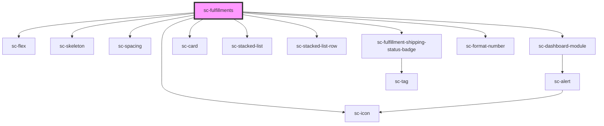

# sc-fulfillments

<!-- Auto Generated Below -->

## Properties

| Property  | Attribute  | Description | Type     | Default     |
| --------- | ---------- | ----------- | -------- | ----------- |
| `heading` | `heading`  |             | `string` | `undefined` |
| `orderId` | `order-id` |             | `string` | `undefined` |

## Dependencies

### Depends on

- [sc-flex](../../../ui/flex)
- [sc-skeleton](../../../ui/skeleton)
- [sc-spacing](../../../ui/spacing)
- [sc-dashboard-module](../../../ui/dashboard-module)
- [sc-card](../../../ui/card)
- [sc-stacked-list](../../../ui/stacked-list)
- [sc-stacked-list-row](../../../ui/stacked-list-row)
- [sc-fulfillment-shipping-status-badge](../../../ui/fulfillment-shipping-status-badge)
- [sc-icon](../../../ui/icon)
- [sc-format-number](../../../util/format-number)

### Graph

----------------------------------------------

*Built with [StencilJS](https://stenciljs.com/)*
