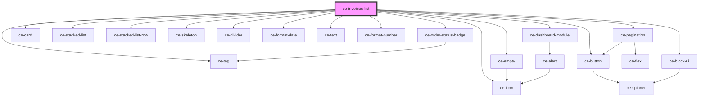

# ce-customer-subscriptions-list

<!-- Auto Generated Below -->

## Properties

| Property  | Attribute  | Description             | Type                                  | Default                                |
| --------- | ---------- | ----------------------- | ------------------------------------- | -------------------------------------- |
| `allLink` | `all-link` |                         | `string`                              | `undefined`                            |
| `heading` | `heading`  |                         | `string`                              | `undefined`                            |
| `query`   | --         | Query to fetch invoices | `{ page: number; per_page: number; }` | `{     page: 1,     per_page: 10,   }` |

## Dependencies

### Depends on

- [ce-tag](../../../ui/tag)
- [ce-order-status-badge](../../../ui/order-status-badge)
- [ce-card](../../../ui/card)
- [ce-stacked-list](../../../ui/stacked-list)
- [ce-stacked-list-row](../../../ui/stacked-list-row)
- [ce-skeleton](../../../ui/skeleton)
- [ce-divider](../../../ui/divider)
- [ce-empty](../../../ui/empty)
- [ce-format-date](../../../util/format-date)
- [ce-text](../../../ui/text)
- [ce-format-number](../../../util/format-number)
- [ce-dashboard-module](../../../ui/dashboard-module)
- [ce-button](../../../ui/button)
- [ce-icon](../../../ui/icon)
- [ce-pagination](../../../ui/pagination)
- [ce-block-ui](../../../ui/block-ui)

### Graph

----------------------------------------------

*Built with [StencilJS](https://stenciljs.com/)*
