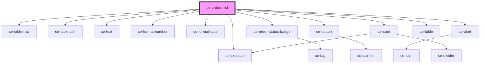

# ce-customer-subscriptions-list

<!-- Auto Generated Below -->

## Properties

| Property | Attribute | Description           | Type     | Default     |
| -------- | --------- | --------------------- | -------- | ----------- |
| `query`  | --        | Query to fetch orders | `object` | `undefined` |

## Dependencies

### Depends on

- [ce-table-row](../../../ui/table-row)
- [ce-table-cell](../../../ui/table-cell)
- [ce-skeleton](../../../ui/skeleton)
- [ce-text](../../../ui/text)
- [ce-format-number](../../../util/format-number)
- [ce-format-date](../../../util/format-date)
- [ce-order-status-badge](../../../ui/order-status-badge)
- [ce-button](../../../ui/button)
- [ce-alert](../../../ui/alert)
- [ce-card](../../../ui/card)
- [ce-table](../../../ui/table)

### Graph

----------------------------------------------

*Built with [StencilJS](https://stenciljs.com/)*
