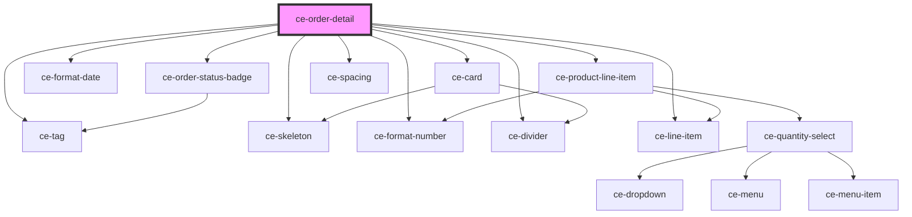

# ce-customer-order

<!-- Auto Generated Below -->

## Properties

| Property  | Attribute  | Description | Type     | Default     |
| --------- | ---------- | ----------- | -------- | ----------- |
| `orderId` | `order-id` |             | `string` | `undefined` |

## Shadow Parts

| Part           | Description |
| -------------- | ----------- |
| `"line-items"` |             |

## Dependencies

### Depends on

- [ce-tag](../../../ui/tag)
- [ce-skeleton](../../../ui/skeleton)
- [ce-format-number](../../../util/format-number)
- [ce-order-status-badge](../../../ui/order-status-badge)
- [ce-format-date](../../../util/format-date)
- [ce-card](../../../ui/card)
- [ce-product-line-item](../../../ui/product-line-item)
- [ce-divider](../../../ui/divider)
- [ce-spacing](../../../ui/spacing)
- [ce-line-item](../../../ui/line-item)

### Graph

----------------------------------------------

*Built with [StencilJS](https://stenciljs.com/)*
