# sc-order

<!-- Auto Generated Below -->

## Properties

| Property      | Attribute  | Description | Type       | Default     |
| ------------- | ---------- | ----------- | ---------- | ----------- |
| `customerIds` | --         |             | `string[]` | `undefined` |
| `heading`     | `heading`  |             | `string`   | `undefined` |
| `orderId`     | `order-id` |             | `string`   | `undefined` |

## Dependencies

### Depends on

- [sc-flex](../../../ui/flex)
- [sc-skeleton](../../../ui/skeleton)
- [sc-empty](../../../ui/empty)
- [sc-product-line-item](../../../ui/product-line-item)
- [sc-divider](../../../ui/divider)
- [sc-line-item](../../../ui/line-item)
- [sc-format-number](../../../util/format-number)
- [sc-spacing](../../../ui/spacing)
- [sc-dashboard-module](../../../ui/dashboard-module)
- [sc-tag](../../../ui/tag)
- [sc-order-manual-instructions](../../confirmation/manual-instructions)
- [sc-card](../../../ui/card)
- [sc-stacked-list](../../../ui/stacked-list)
- [sc-stacked-list-row](../../../ui/stacked-list-row)
- [sc-order-status-badge](../../../ui/order-status-badge)
- [sc-format-date](../../../util/format-date)
- [sc-payment-method](../../../ui/sc-payment-method)
- [sc-button](../../../ui/button)
- [sc-icon](../../../ui/icon)
- [sc-purchase-downloads-list](../../../ui/purchase-downloads-list)

### Graph

```mermaid
graph TD;
  sc-order --> sc-flex
  sc-order --> sc-skeleton
  sc-order --> sc-empty
  sc-order --> sc-product-line-item
  sc-order --> sc-divider
  sc-order --> sc-line-item
  sc-order --> sc-format-number
  sc-order --> sc-spacing
  sc-order --> sc-dashboard-module
  sc-order --> sc-tag
  sc-order --> sc-order-manual-instructions
  sc-order --> sc-card
  sc-order --> sc-stacked-list
  sc-order --> sc-stacked-list-row
  sc-order --> sc-order-status-badge
  sc-order --> sc-format-date
  sc-order --> sc-payment-method
  sc-order --> sc-button
  sc-order --> sc-icon
  sc-order --> sc-purchase-downloads-list
  sc-empty --> sc-icon
  sc-product-line-item --> sc-format-number
  sc-product-line-item --> sc-quantity-select
  sc-product-line-item --> sc-icon
  sc-product-line-item --> sc-line-item
  sc-quantity-select --> sc-icon
  sc-dashboard-module --> sc-alert
  sc-alert --> sc-icon
  sc-order-manual-instructions --> sc-alert
  sc-order-status-badge --> sc-tag
  sc-payment-method --> sc-tooltip
  sc-payment-method --> sc-button
  sc-payment-method --> sc-icon
  sc-payment-method --> sc-tag
  sc-payment-method --> sc-cc-logo
  sc-payment-method --> sc-text
  sc-button --> sc-spinner
  sc-cc-logo --> sc-icon
  sc-purchase-downloads-list --> sc-divider
  sc-purchase-downloads-list --> sc-empty
  sc-purchase-downloads-list --> sc-card
  sc-purchase-downloads-list --> sc-stacked-list
  sc-purchase-downloads-list --> sc-stacked-list-row
  sc-purchase-downloads-list --> sc-skeleton
  sc-purchase-downloads-list --> sc-spacing
  sc-purchase-downloads-list --> sc-format-bytes
  sc-purchase-downloads-list --> sc-icon
  sc-purchase-downloads-list --> sc-dashboard-module
  sc-purchase-downloads-list --> sc-button
  sc-purchase-downloads-list --> sc-block-ui
  sc-block-ui --> sc-spinner
  style sc-order fill:#f9f,stroke:#333,stroke-width:4px
```

----------------------------------------------

*Built with [StencilJS](https://stenciljs.com/)*
