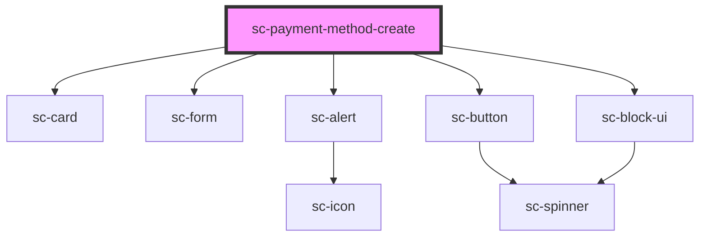

# ce-payment-method-create

<!-- Auto Generated Below -->

## Properties

| Property       | Attribute       | Description | Type     | Default     |
| -------------- | --------------- | ----------- | -------- | ----------- |
| `clientSecret` | `client-secret` |             | `string` | `undefined` |
| `error`        | `error`         |             | `string` | `undefined` |
| `successUrl`   | `success-url`   |             | `string` | `undefined` |

## Dependencies

### Depends on

- [sc-card](../../../ui/card)
- [sc-form](../../../ui/form)
- [sc-alert](../../../ui/alert)
- [sc-button](../../../ui/button)
- [sc-block-ui](../../../ui/block-ui)

### Graph

----------------------------------------------

*Built with [StencilJS](https://stenciljs.com/)*
