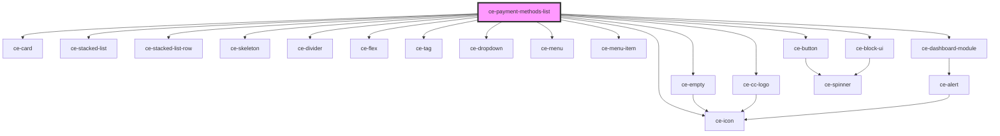

# ce-payment-methods-list

<!-- Auto Generated Below -->

## Properties

| Property  | Attribute | Description                   | Type     | Default     |
| --------- | --------- | ----------------------------- | -------- | ----------- |
| `heading` | `heading` |                               | `string` | `undefined` |
| `query`   | --        | Query to fetch paymentMethods | `object` | `undefined` |

## Dependencies

### Depends on

- [ce-card](../../../ui/card)
- [ce-stacked-list](../../../ui/ce-stacked-list)
- [ce-stacked-list-row](../../../ui/ce-stacked-list-row)
- [ce-skeleton](../../../ui/skeleton)
- [ce-divider](../../../ui/divider)
- [ce-empty](../../../ui/ce-empty)
- [ce-flex](../../../ui/flex)
- [ce-cc-logo](../../../ui/ce-cc-logo)
- [ce-tag](../../../ui/tag)
- [ce-dropdown](../../../ui/dropdown)
- [ce-icon](../../../ui/icon)
- [ce-menu](../../../ui/menu)
- [ce-menu-item](../../../ui/menu-item)
- [ce-dashboard-module](../../../ui/ce-dashboard-module)
- [ce-button](../../../ui/button)
- [ce-block-ui](../../../ui/block-ui)

### Graph

----------------------------------------------

*Built with [StencilJS](https://stenciljs.com/)*
