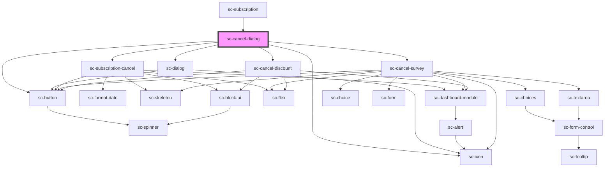

# sc-cancel-dialog

<!-- Auto Generated Below -->

## Properties

| Property       | Attribute | Description | Type                   | Default     |
| -------------- | --------- | ----------- | ---------------------- | ----------- |
| `open`         | `open`    |             | `boolean`              | `undefined` |
| `protocol`     | --        |             | `SubscriptionProtocol` | `undefined` |
| `subscription` | --        |             | `Subscription`         | `undefined` |

## Events

| Event            | Description | Type                                                     |
| ---------------- | ----------- | -------------------------------------------------------- |
| `scRefresh`      |             | `CustomEvent<void>`                                      |
| `scRequestClose` |             | `CustomEvent<"close-button" \| "keyboard" \| "overlay">` |

## Dependencies

### Used by

 - [sc-subscription](../subscription)

### Depends on

- [sc-dialog](../../../ui/sc-dialog)
- [sc-button](../../../ui/button)
- [sc-icon](../../../ui/icon)
- [sc-subscription-cancel](../subscription-cancel)
- [sc-cancel-survey](../sc-cancel-survey)
- [sc-cancel-discount](../sc-cancel-discount)

### Graph

----------------------------------------------

*Built with [StencilJS](https://stenciljs.com/)*
