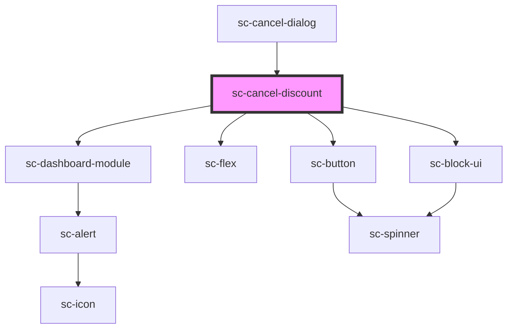

# sc-cancel-discount

<!-- Auto Generated Below -->

## Properties

| Property       | Attribute | Description | Type                   | Default     |
| -------------- | --------- | ----------- | ---------------------- | ----------- |
| `comment`      | `comment` |             | `string`               | `undefined` |
| `protocol`     | --        |             | `SubscriptionProtocol` | `undefined` |
| `reason`       | --        |             | `CancellationReason`   | `undefined` |
| `subscription` | --        |             | `Subscription`         | `undefined` |

## Events

| Event         | Description | Type                |
| ------------- | ----------- | ------------------- |
| `scCancel`    |             | `CustomEvent<void>` |
| `scPreserved` |             | `CustomEvent<void>` |

## Dependencies

### Used by

 - [sc-cancel-dialog](../sc-cancel-dialog)

### Depends on

- [sc-dashboard-module](../../../ui/dashboard-module)
- [sc-flex](../../../ui/flex)
- [sc-button](../../../ui/button)
- [sc-block-ui](../../../ui/block-ui)

### Graph

----------------------------------------------

*Built with [StencilJS](https://stenciljs.com/)*
