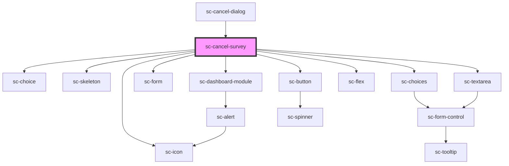

# sc-cancel-survey

<!-- Auto Generated Below -->

## Properties

| Property   | Attribute | Description | Type                   | Default     |
| ---------- | --------- | ----------- | ---------------------- | ----------- |
| `protocol` | --        |             | `SubscriptionProtocol` | `undefined` |

## Events

| Event            | Description | Type                                                            |
| ---------------- | ----------- | --------------------------------------------------------------- |
| `scAbandon`      |             | `CustomEvent<void>`                                             |
| `scSubmitReason` |             | `CustomEvent<{ reason: CancellationReason; comment: string; }>` |

## Dependencies

### Used by

 - [sc-cancel-dialog](../sc-cancel-dialog)

### Depends on

- [sc-choice](../../../ui/choice)
- [sc-skeleton](../../../ui/skeleton)
- [sc-dashboard-module](../../../ui/dashboard-module)
- [sc-form](../../../ui/form)
- [sc-choices](../../../ui/choices)
- [sc-textarea](../../../ui/sc-textarea)
- [sc-flex](../../../ui/flex)
- [sc-button](../../../ui/button)
- [sc-icon](../../../ui/icon)

### Graph

----------------------------------------------

*Built with [StencilJS](https://stenciljs.com/)*
