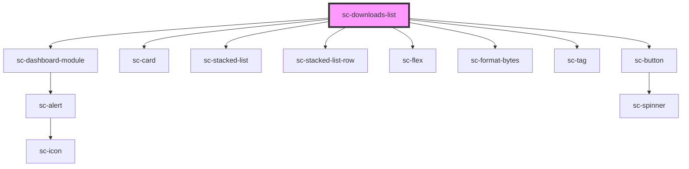

# sc-downloads-list

<!-- Auto Generated Below -->

## Properties

| Property     | Attribute     | Description | Type         | Default     |
| ------------ | ------------- | ----------- | ------------ | ----------- |
| `customerId` | `customer-id` |             | `string`     | `undefined` |
| `downloads`  | --            |             | `Download[]` | `undefined` |
| `heading`    | `heading`     |             | `string`     | `undefined` |

## Shadow Parts

| Part     | Description |
| -------- | ----------- |
| `"base"` |             |

## Dependencies

### Depends on

- [sc-dashboard-module](../../../ui/dashboard-module)
- [sc-card](../../../ui/card)
- [sc-stacked-list](../../../ui/stacked-list)
- [sc-stacked-list-row](../../../ui/stacked-list-row)
- [sc-flex](../../../ui/flex)
- [sc-format-bytes](../../../util/format-bytes)
- [sc-tag](../../../ui/tag)
- [sc-button](../../../ui/button)

### Graph

----------------------------------------------

*Built with [StencilJS](https://stenciljs.com/)*
