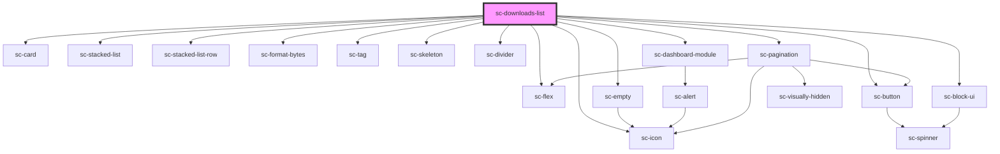

# sc-downloads-list

<!-- Auto Generated Below -->

## Properties

| Property     | Attribute     | Description | Type     | Default                                |
| ------------ | ------------- | ----------- | -------- | -------------------------------------- |
| `customerId` | `customer-id` |             | `string` | `undefined`                            |
| `heading`    | `heading`     |             | `string` | `undefined`                            |
| `productId`  | `product-id`  |             | `string` | `undefined`                            |
| `query`      | `query`       |             | `any`    | `{     page: 1,     per_page: 20,   }` |

## Shadow Parts

| Part     | Description |
| -------- | ----------- |
| `"base"` |             |

## Dependencies

### Depends on

- [sc-icon](../../../ui/icon)
- [sc-card](../../../ui/card)
- [sc-stacked-list](../../../ui/stacked-list)
- [sc-stacked-list-row](../../../ui/stacked-list-row)
- [sc-flex](../../../ui/flex)
- [sc-format-bytes](../../../util/format-bytes)
- [sc-tag](../../../ui/tag)
- [sc-button](../../../ui/button)
- [sc-skeleton](../../../ui/skeleton)
- [sc-divider](../../../ui/divider)
- [sc-empty](../../../ui/empty)
- [sc-dashboard-module](../../../ui/dashboard-module)
- [sc-pagination](../../../ui/pagination)
- [sc-block-ui](../../../ui/block-ui)

### Graph

----------------------------------------------

*Built with [StencilJS](https://stenciljs.com/)*
