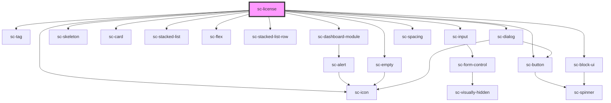

# sc-license

<!-- Auto Generated Below -->

## Properties

| Property    | Attribute    | Description    | Type     | Default     |
| ----------- | ------------ | -------------- | -------- | ----------- |
| `licenseId` | `license-id` | The license id | `string` | `undefined` |

## Dependencies

### Depends on

- [sc-tag](../../../ui/tag)
- [sc-dashboard-module](../../../ui/dashboard-module)
- [sc-skeleton](../../../ui/skeleton)
- [sc-card](../../../ui/card)
- [sc-stacked-list](../../../ui/stacked-list)
- [sc-flex](../../../ui/flex)
- [sc-empty](../../../ui/empty)
- [sc-stacked-list-row](../../../ui/stacked-list-row)
- [sc-input](../../../ui/input)
- [sc-button](../../../ui/button)
- [sc-block-ui](../../../ui/block-ui)
- [sc-dialog](../../../ui/sc-dialog)
- [sc-icon](../../../ui/icon)
- [sc-spacing](../../../ui/spacing)

### Graph

----------------------------------------------

*Built with [StencilJS](https://stenciljs.com/)*
