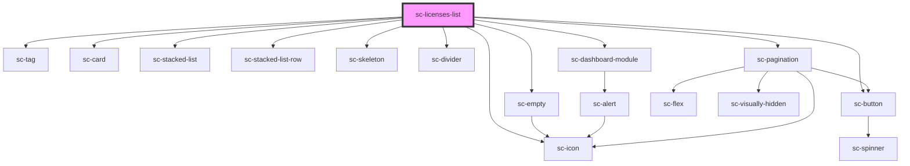

# sc-licenses-list

<!-- Auto Generated Below -->

## Properties

| Property     | Attribute     | Description                          | Type                                  | Default                                |
| ------------ | ------------- | ------------------------------------ | ------------------------------------- | -------------------------------------- |
| `allLink`    | `all-link`    | View all link                        | `string`                              | `undefined`                            |
| `heading`    | `heading`     | The heading of the licenses          | `string`                              | `__('Licenses', 'surecart')`           |
| `isCustomer` | `is-customer` | Whether the current user is customer | `boolean`                             | `undefined`                            |
| `licenses`   | --            |                                      | `License[]`                           | `[]`                                   |
| `query`      | --            | Query to fetch licenses              | `{ page: number; per_page: number; }` | `{     page: 1,     per_page: 10,   }` |

## Shadow Parts

| Part     | Description |
| -------- | ----------- |
| `"base"` |             |

## Dependencies

### Depends on

- [sc-tag](../../../ui/tag)
- [sc-card](../../../ui/card)
- [sc-stacked-list](../../../ui/stacked-list)
- [sc-stacked-list-row](../../../ui/stacked-list-row)
- [sc-skeleton](../../../ui/skeleton)
- [sc-divider](../../../ui/divider)
- [sc-empty](../../../ui/empty)
- [sc-icon](../../../ui/icon)
- [sc-dashboard-module](../../../ui/dashboard-module)
- [sc-button](../../../ui/button)
- [sc-pagination](../../../ui/pagination)

### Graph

----------------------------------------------

*Built with [StencilJS](https://stenciljs.com/)*
