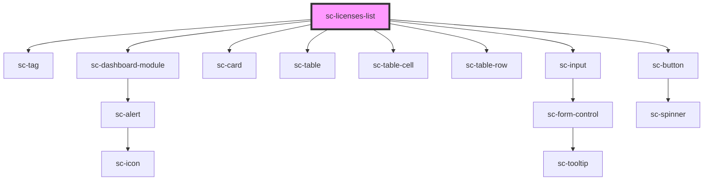

# sc-licenses-list

<!-- Auto Generated Below -->

## Properties

| Property      | Attribute | Description | Type           | Default     |
| ------------- | --------- | ----------- | -------------- | ----------- |
| `activations` | --        |             | `Activation[]` | `[]`        |
| `copied`      | `copied`  |             | `boolean`      | `undefined` |
| `heading`     | `heading` |             | `string`       | `undefined` |
| `licenses`    | --        |             | `License[]`    | `[]`        |

## Shadow Parts

| Part     | Description |
| -------- | ----------- |
| `"base"` |             |

## Dependencies

### Depends on

- [sc-tag](../../../ui/tag)
- [sc-dashboard-module](../../../ui/dashboard-module)
- [sc-card](../../../ui/card)
- [sc-table](../../../ui/table)
- [sc-table-cell](../../../ui/table-cell)
- [sc-table-row](../../../ui/table-row)
- [sc-input](../../../ui/input)
- [sc-button](../../../ui/button)

### Graph

----------------------------------------------

*Built with [StencilJS](https://stenciljs.com/)*
