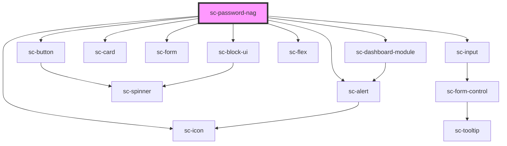

# sc-password-nag

<!-- Auto Generated Below -->

## Properties

| Property     | Attribute     | Description        | Type                                                        | Default     |
| ------------ | ------------- | ------------------ | ----------------------------------------------------------- | ----------- |
| `open`       | `open`        |                    | `boolean`                                                   | `true`      |
| `successUrl` | `success-url` | The success url.   | `string`                                                    | `undefined` |
| `type`       | `type`        | The type of alert. | `"danger" \| "info" \| "primary" \| "success" \| "warning"` | `'primary'` |

## Dependencies

### Depends on

- [sc-alert](../../../ui/alert)
- [sc-dashboard-module](../../../ui/dashboard-module)
- [sc-button](../../../ui/button)
- [sc-icon](../../../ui/icon)
- [sc-card](../../../ui/card)
- [sc-form](../../../ui/form)
- [sc-input](../../../ui/input)
- [sc-flex](../../../ui/flex)
- [sc-block-ui](../../../ui/block-ui)

### Graph

----------------------------------------------

*Built with [StencilJS](https://stenciljs.com/)*
