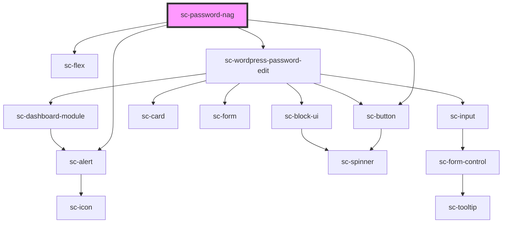

# sc-password-nag

<!-- Auto Generated Below -->

## Properties

| Property | Attribute | Description        | Type                                                        | Default     |
| -------- | --------- | ------------------ | ----------------------------------------------------------- | ----------- |
| `open`   | `open`    |                    | `boolean`                                                   | `true`      |
| `type`   | `type`    | The type of alert. | `"danger" \| "info" \| "primary" \| "success" \| "warning"` | `'warning'` |

## Dependencies

### Depends on

- [sc-alert](../../../ui/alert)
- [sc-flex](../../../ui/flex)
- [sc-button](../../../ui/button)
- [sc-wordpress-password-edit](../wordpress-password-edit)

### Graph

----------------------------------------------

*Built with [StencilJS](https://stenciljs.com/)*
