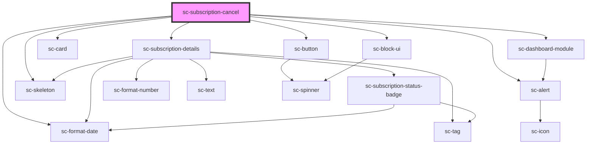

# ce-subscription-cancel

<!-- Auto Generated Below -->

## Properties

| Property         | Attribute         | Description | Type           | Default     |
| ---------------- | ----------------- | ----------- | -------------- | ----------- |
| `backUrl`        | `back-url`        |             | `string`       | `undefined` |
| `heading`        | `heading`         |             | `string`       | `undefined` |
| `subscription`   | --                |             | `Subscription` | `undefined` |
| `subscriptionId` | `subscription-id` |             | `string`       | `undefined` |
| `successUrl`     | `success-url`     |             | `string`       | `undefined` |

## Dependencies

### Depends on

- [sc-subscription-details](../subscription-details)
- [sc-alert](../../../ui/alert)
- [sc-format-date](../../../util/format-date)
- [sc-skeleton](../../../ui/skeleton)
- [sc-dashboard-module](../../../ui/dashboard-module)
- [sc-card](../../../ui/card)
- [sc-button](../../../ui/button)
- [sc-block-ui](../../../ui/block-ui)

### Graph

----------------------------------------------

*Built with [StencilJS](https://stenciljs.com/)*
