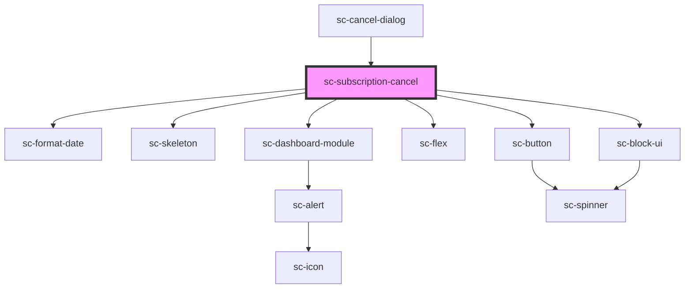

# ce-subscription-cancel

<!-- Auto Generated Below -->

## Properties

| Property       | Attribute     | Description | Type                   | Default     |
| -------------- | ------------- | ----------- | ---------------------- | ----------- |
| `backUrl`      | `back-url`    |             | `string`               | `undefined` |
| `heading`      | `heading`     |             | `string`               | `undefined` |
| `protocol`     | --            |             | `SubscriptionProtocol` | `undefined` |
| `subscription` | --            |             | `Subscription`         | `undefined` |
| `successUrl`   | `success-url` |             | `string`               | `undefined` |

## Events

| Event         | Description | Type                |
| ------------- | ----------- | ------------------- |
| `scAbandon`   |             | `CustomEvent<void>` |
| `scCancelled` |             | `CustomEvent<void>` |

## Dependencies

### Used by

 - [sc-cancel-dialog](../sc-cancel-dialog)

### Depends on

- [sc-format-date](../../../util/format-date)
- [sc-skeleton](../../../ui/skeleton)
- [sc-dashboard-module](../../../ui/dashboard-module)
- [sc-flex](../../../ui/flex)
- [sc-button](../../../ui/button)
- [sc-block-ui](../../../ui/block-ui)

### Graph

----------------------------------------------

*Built with [StencilJS](https://stenciljs.com/)*
