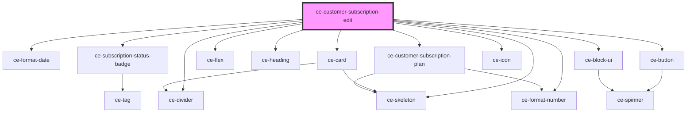

# ce-customer-subscription

<!-- Auto Generated Below -->

## Properties

| Property          | Attribute         | Description | Type             | Default     |
| ----------------- | ----------------- | ----------- | ---------------- | ----------- |
| `isIndex`         | `is-index`        |             | `boolean`        | `undefined` |
| `loading`         | `loading`         |             | `boolean`        | `undefined` |
| `subscription_id` | `subscription_id` |             | `string`         | `undefined` |
| `subscriptions`   | --                |             | `Subscription[]` | `undefined` |
| `upgradeGroups`   | --                |             | `string[][]`     | `undefined` |

## Events

| Event                 | Description | Type                                           |
| --------------------- | ----------- | ---------------------------------------------- |
| `ceFetchSubscription` |             | `CustomEvent<{ id: string; props?: object; }>` |

## Shadow Parts

| Part      | Description |
| --------- | ----------- |
| `"name"`  |             |
| `"plans"` |             |
| `"price"` |             |

## Dependencies

### Depends on

- [ce-format-date](../../../util/format-date)
- [ce-subscription-status-badge](../../../ui/subscription-status-badge)
- [ce-card](../../../ui/card)
- [ce-flex](../../../ui/flex)
- [ce-skeleton](../../../ui/skeleton)
- [ce-heading](../../../ui/heading)
- [ce-divider](../../../ui/divider)
- [ce-format-number](../../../util/format-number)
- [ce-customer-subscription-plan](../subscription-plan)
- [ce-button](../../../ui/button)
- [ce-icon](../../../ui/icon)
- [ce-block-ui](../../../ui/block-ui)

### Graph

----------------------------------------------

*Built with [StencilJS](https://stenciljs.com/)*
