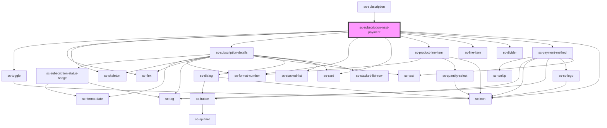

# ce-subscription-details

<!-- Auto Generated Below -->

## Properties

| Property       | Attribute | Description | Type           | Default     |
| -------------- | --------- | ----------- | -------------- | ----------- |
| `subscription` | --        |             | `Subscription` | `undefined` |

## Dependencies

### Used by

 - [sc-subscription](../subscription)

### Depends on

- [sc-toggle](../../../ui/sc-toggle)
- [sc-flex](../../../ui/flex)
- [sc-skeleton](../../../ui/skeleton)
- [sc-subscription-details](.)
- [sc-format-number](../../../util/format-number)
- [sc-card](../../../ui/card)
- [sc-product-line-item](../../../ui/product-line-item)
- [sc-line-item](../../../ui/line-item)
- [sc-divider](../../../ui/divider)
- [sc-payment-method](../../../ui/sc-payment-method)
- [sc-icon](../../../ui/icon)

### Graph

----------------------------------------------

*Built with [StencilJS](https://stenciljs.com/)*
