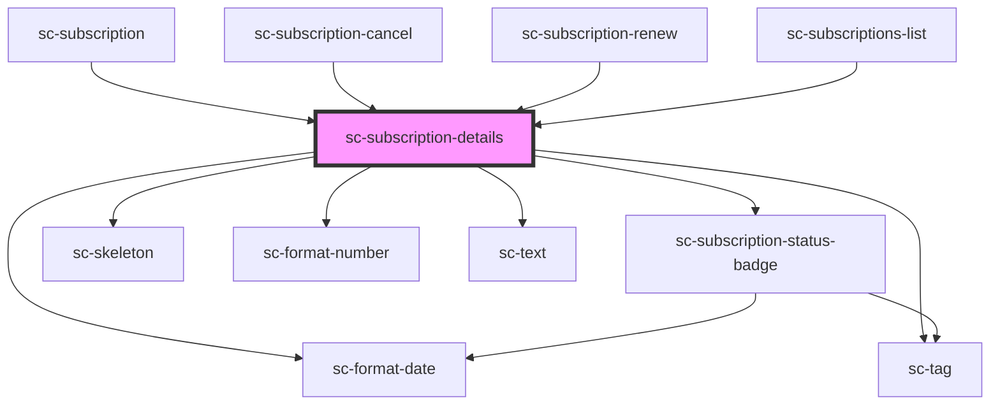

# ce-subscription-details

<!-- Auto Generated Below -->

## Properties

| Property          | Attribute           | Description | Type           | Default     |
| ----------------- | ------------------- | ----------- | -------------- | ----------- |
| `hideRenewalText` | `hide-renewal-text` |             | `boolean`      | `undefined` |
| `pendingPrice`    | --                  |             | `Price`        | `undefined` |
| `subscription`    | --                  |             | `Subscription` | `undefined` |

## Dependencies

### Used by

 - [sc-subscription](../subscription)
 - [sc-subscription-cancel](../subscription-cancel)
 - [sc-subscription-renew](../subscription-renew)
 - [sc-subscriptions-list](../subscriptions-list)

### Depends on

- [sc-subscription-status-badge](../../../ui/subscription-status-badge)
- [sc-format-date](../../../util/format-date)
- [sc-skeleton](../../../ui/skeleton)
- [sc-format-number](../../../util/format-number)
- [sc-text](../../../ui/text)
- [sc-tag](../../../ui/tag)

### Graph

----------------------------------------------

*Built with [StencilJS](https://stenciljs.com/)*
