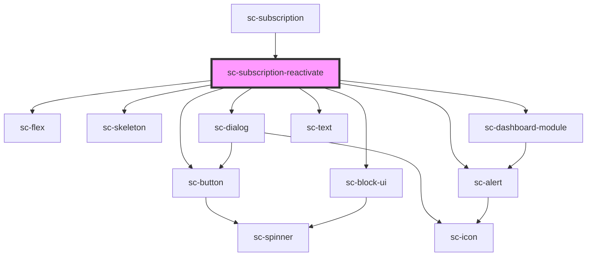

# sc-subscription-reactivate

<!-- Auto Generated Below -->

## Properties

| Property       | Attribute | Description                    | Type           | Default     |
| -------------- | --------- | ------------------------------ | -------------- | ----------- |
| `open`         | `open`    | Whether it is open             | `boolean`      | `undefined` |
| `subscription` | --        | The subscription to reactivate | `Subscription` | `undefined` |

## Events

| Event            | Description             | Type                                                     |
| ---------------- | ----------------------- | -------------------------------------------------------- |
| `scRefresh`      | Refresh subscriptions   | `CustomEvent<void>`                                      |
| `scRequestClose` | Reactivate modal closed | `CustomEvent<"close-button" \| "keyboard" \| "overlay">` |

## Dependencies

### Used by

 - [sc-subscription](../subscription)

### Depends on

- [sc-flex](../../../ui/flex)
- [sc-skeleton](../../../ui/skeleton)
- [sc-dialog](../../../ui/sc-dialog)
- [sc-dashboard-module](../../../ui/dashboard-module)
- [sc-alert](../../../ui/alert)
- [sc-text](../../../ui/text)
- [sc-button](../../../ui/button)
- [sc-block-ui](../../../ui/block-ui)

### Graph

----------------------------------------------

*Built with [StencilJS](https://stenciljs.com/)*
