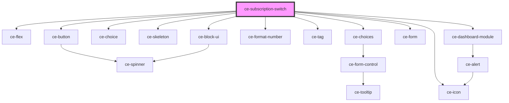

# ce-subscription-switch

<!-- Auto Generated Below -->

## Properties

| Property         | Attribute | Description                        | Type           | Default     |
| ---------------- | --------- | ---------------------------------- | -------------- | ----------- |
| `heading`        | `heading` |                                    | `string`       | `undefined` |
| `productGroupId` | --        |                                    | `ProductGroup` | `undefined` |
| `query`          | --        | Customer id to fetch subscriptions | `object`       | `undefined` |
| `subscription`   | --        |                                    | `Subscription` | `undefined` |

## Dependencies

### Depends on

- [ce-flex](../../../ui/flex)
- [ce-button](../../../ui/button)
- [ce-choice](../../../ui/choice)
- [ce-skeleton](../../../ui/skeleton)
- [ce-choices](../../../ui/choices)
- [ce-format-number](../../../util/format-number)
- [ce-tag](../../../ui/tag)
- [ce-dashboard-module](../../../ui/dashboard-module)
- [ce-form](../../../ui/form)
- [ce-icon](../../../ui/icon)
- [ce-block-ui](../../../ui/block-ui)

### Graph

----------------------------------------------

*Built with [StencilJS](https://stenciljs.com/)*
