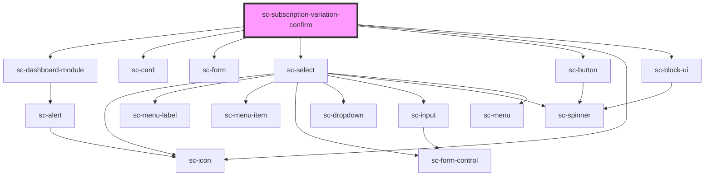

# sc-subscription-ad-hoc-confirm

<!-- Auto Generated Below -->

## Properties

| Property       | Attribute | Description | Type           | Default     |
| -------------- | --------- | ----------- | -------------- | ----------- |
| `heading`      | `heading` |             | `string`       | `undefined` |
| `price`        | --        |             | `Price`        | `undefined` |
| `product`      | --        |             | `Product`      | `undefined` |
| `subscription` | --        |             | `Subscription` | `undefined` |

## Shadow Parts

| Part            | Description |
| --------------- | ----------- |
| `"name__input"` |             |

## Dependencies

### Depends on

- [sc-dashboard-module](../../../ui/dashboard-module)
- [sc-card](../../../ui/card)
- [sc-form](../../../ui/form)
- [sc-select](../../../ui/select)
- [sc-button](../../../ui/button)
- [sc-icon](../../../ui/icon)
- [sc-block-ui](../../../ui/block-ui)

### Graph

----------------------------------------------

*Built with [StencilJS](https://stenciljs.com/)*
