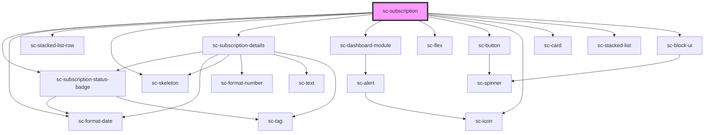

# ce-subscription

<!-- Auto Generated Below -->

## Properties

| Property         | Attribute         | Description                        | Type           | Default     |
| ---------------- | ----------------- | ---------------------------------- | -------------- | ----------- |
| `heading`        | `heading`         |                                    | `string`       | `undefined` |
| `query`          | --                |                                    | `object`       | `undefined` |
| `showCancel`     | `show-cancel`     |                                    | `boolean`      | `undefined` |
| `subscription`   | --                |                                    | `Subscription` | `undefined` |
| `subscriptionId` | `subscription-id` | Customer id to fetch subscriptions | `string`       | `undefined` |

## Dependencies

### Depends on

- [sc-subscription-status-badge](../../../ui/subscription-status-badge)
- [sc-format-date](../../../util/format-date)
- [sc-stacked-list-row](../../../ui/stacked-list-row)
- [sc-skeleton](../../../ui/skeleton)
- [sc-subscription-details](../subscription-details)
- [sc-dashboard-module](../../../ui/dashboard-module)
- [sc-flex](../../../ui/flex)
- [sc-button](../../../ui/button)
- [sc-icon](../../../ui/icon)
- [sc-card](../../../ui/card)
- [sc-stacked-list](../../../ui/stacked-list)
- [sc-block-ui](../../../ui/block-ui)

### Graph

----------------------------------------------

*Built with [StencilJS](https://stenciljs.com/)*
