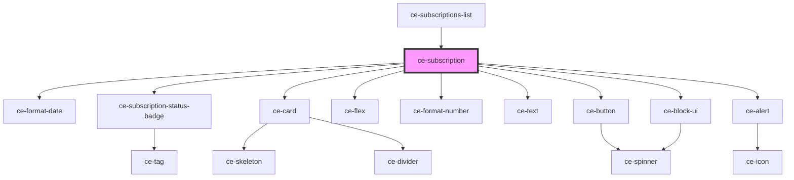

# ce-customer-subscription

<!-- Auto Generated Below -->

## Properties

| Property        | Attribute | Description | Type           | Default     |
| --------------- | --------- | ----------- | -------------- | ----------- |
| `subscription`  | --        |             | `Subscription` | `undefined` |
| `upgradeGroups` | --        |             | `string[][]`   | `undefined` |

## Events

| Event                  | Description | Type                        |
| ---------------------- | ----------- | --------------------------- |
| `ceUpdateSubscription` |             | `CustomEvent<Subscription>` |

## Shadow Parts

| Part        | Description |
| ----------- | ----------- |
| `"actions"` |             |
| `"card"`    |             |
| `"details"` |             |
| `"name"`    |             |
| `"price"`   |             |
| `"renewal"` |             |

## Dependencies

### Used by

 - [ce-subscriptions-list](../subscriptions-list)

### Depends on

- [ce-format-date](../../../util/format-date)
- [ce-subscription-status-badge](../../../ui/subscription-status-badge)
- [ce-card](../../../ui/card)
- [ce-flex](../../../ui/flex)
- [ce-format-number](../../../util/format-number)
- [ce-text](../../../ui/text)
- [ce-button](../../../ui/button)
- [ce-alert](../../../ui/alert)
- [ce-block-ui](../../../ui/block-ui)

### Graph

----------------------------------------------

*Built with [StencilJS](https://stenciljs.com/)*
