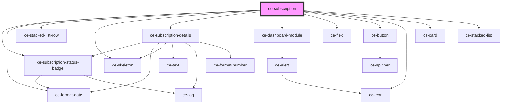

# ce-subscription

<!-- Auto Generated Below -->

## Properties

| Property         | Attribute         | Description                        | Type           | Default     |
| ---------------- | ----------------- | ---------------------------------- | -------------- | ----------- |
| `heading`        | `heading`         |                                    | `string`       | `undefined` |
| `query`          | --                |                                    | `object`       | `undefined` |
| `subscription`   | --                |                                    | `Subscription` | `undefined` |
| `subscriptionId` | `subscription-id` | Customer id to fetch subscriptions | `string`       | `undefined` |

## Dependencies

### Depends on

- [ce-subscription-status-badge](../../../ui/subscription-status-badge)
- [ce-format-date](../../../util/format-date)
- [ce-stacked-list-row](../../../ui/ce-stacked-list-row)
- [ce-skeleton](../../../ui/skeleton)
- [ce-subscription-details](../ce-subscription-details)
- [ce-dashboard-module](../../../ui/ce-dashboard-module)
- [ce-flex](../../../ui/flex)
- [ce-button](../../../ui/button)
- [ce-icon](../../../ui/icon)
- [ce-card](../../../ui/card)
- [ce-stacked-list](../../../ui/ce-stacked-list)

### Graph

----------------------------------------------

*Built with [StencilJS](https://stenciljs.com/)*
