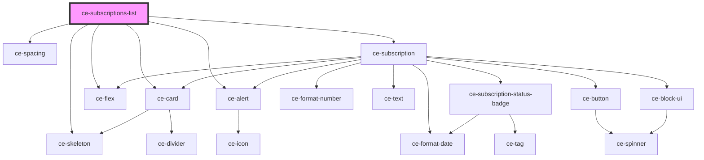

# ce-customer-subscriptions-list

<!-- Auto Generated Below -->

## Properties

| Property         | Attribute         | Description                        | Type                          | Default        |
| ---------------- | ----------------- | ---------------------------------- | ----------------------------- | -------------- |
| `cancelBehavior` | `cancel-behavior` |                                    | `"immediate" \| "period_end"` | `'period_end'` |
| `query`          | --                | Customer id to fetch subscriptions | `object`                      | `undefined`    |

## Dependencies

### Depends on

- [ce-card](../../../ui/card)
- [ce-flex](../../../ui/flex)
- [ce-skeleton](../../../ui/skeleton)
- [ce-alert](../../../ui/alert)
- [ce-spacing](../../../ui/spacing)
- [ce-subscription](../subscription)

### Graph

----------------------------------------------

*Built with [StencilJS](https://stenciljs.com/)*
