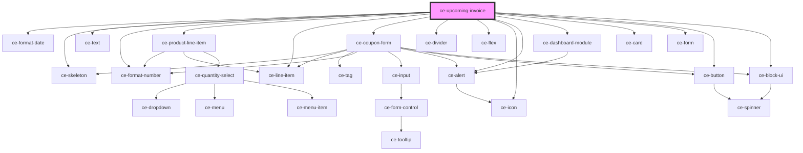

# ce-customer-subscription

<!-- Auto Generated Below -->

## Properties

| Property         | Attribute         | Description | Type                                            | Default     |
| ---------------- | ----------------- | ----------- | ----------------------------------------------- | ----------- |
| `discount`       | --                |             | `{ promotion_code?: string; coupon?: string; }` | `undefined` |
| `heading`        | `heading`         |             | `string`                                        | `undefined` |
| `payment_method` | --                |             | `PaymentMethod`                                 | `undefined` |
| `priceId`        | `price-id`        |             | `string`                                        | `undefined` |
| `quantity`       | `quantity`        |             | `number`                                        | `undefined` |
| `subscriptionId` | `subscription-id` |             | `string`                                        | `undefined` |
| `successUrl`     | `success-url`     |             | `string`                                        | `undefined` |

## Dependencies

### Depends on

- [ce-format-date](../../../util/format-date)
- [ce-skeleton](../../../ui/skeleton)
- [ce-text](../../../ui/text)
- [ce-format-number](../../../util/format-number)
- [ce-product-line-item](../../../ui/product-line-item)
- [ce-line-item](../../../ui/line-item)
- [ce-coupon-form](../../../ui/coupon-form)
- [ce-divider](../../../ui/divider)
- [ce-flex](../../../ui/flex)
- [ce-icon](../../../ui/icon)
- [ce-alert](../../../ui/alert)
- [ce-dashboard-module](../../../ui/dashboard-module)
- [ce-card](../../../ui/card)
- [ce-form](../../../ui/form)
- [ce-button](../../../ui/button)
- [ce-block-ui](../../../ui/block-ui)

### Graph

----------------------------------------------

*Built with [StencilJS](https://stenciljs.com/)*
