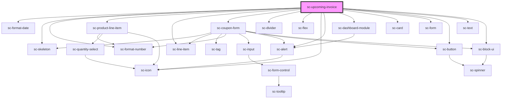

# ce-customer-subscription

<!-- Auto Generated Below -->

## Properties

| Property                 | Attribute                  | Description | Type                                            | Default     |
| ------------------------ | -------------------------- | ----------- | ----------------------------------------------- | ----------- |
| `adHocAmount`            | `ad-hoc-amount`            |             | `number`                                        | `undefined` |
| `discount`               | --                         |             | `{ promotion_code?: string; coupon?: string; }` | `undefined` |
| `heading`                | `heading`                  |             | `string`                                        | `undefined` |
| `payment_method`         | --                         |             | `PaymentMethod`                                 | `undefined` |
| `priceId`                | `price-id`                 |             | `string`                                        | `undefined` |
| `quantity`               | `quantity`                 |             | `number`                                        | `undefined` |
| `quantityUpdatesEnabled` | `quantity-updates-enabled` |             | `boolean`                                       | `true`      |
| `subscriptionId`         | `subscription-id`          |             | `string`                                        | `undefined` |
| `successUrl`             | `success-url`              |             | `string`                                        | `undefined` |

## Dependencies

### Depends on

- [sc-format-date](../../../util/format-date)
- [sc-skeleton](../../../ui/skeleton)
- [sc-format-number](../../../util/format-number)
- [sc-product-line-item](../../../ui/product-line-item)
- [sc-line-item](../../../ui/line-item)
- [sc-coupon-form](../../../ui/coupon-form)
- [sc-divider](../../../ui/divider)
- [sc-flex](../../../ui/flex)
- [sc-icon](../../../ui/icon)
- [sc-alert](../../../ui/alert)
- [sc-dashboard-module](../../../ui/dashboard-module)
- [sc-card](../../../ui/card)
- [sc-form](../../../ui/form)
- [sc-button](../../../ui/button)
- [sc-text](../../../ui/text)
- [sc-block-ui](../../../ui/block-ui)

### Graph

----------------------------------------------

*Built with [StencilJS](https://stenciljs.com/)*
