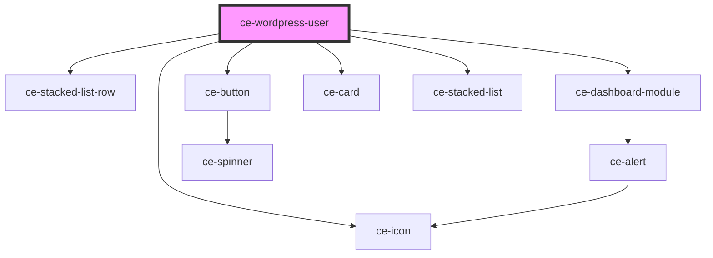

# ce-customer-details

<!-- Auto Generated Below -->

## Properties

| Property  | Attribute | Description | Type            | Default     |
| --------- | --------- | ----------- | --------------- | ----------- |
| `heading` | `heading` |             | `string`        | `undefined` |
| `user`    | --        |             | `WordPressUser` | `undefined` |

## Dependencies

### Depends on

- [ce-stacked-list-row](../../../ui/stacked-list-row)
- [ce-dashboard-module](../../../ui/dashboard-module)
- [ce-button](../../../ui/button)
- [ce-icon](../../../ui/icon)
- [ce-card](../../../ui/card)
- [ce-stacked-list](../../../ui/stacked-list)

### Graph

----------------------------------------------

*Built with [StencilJS](https://stenciljs.com/)*
