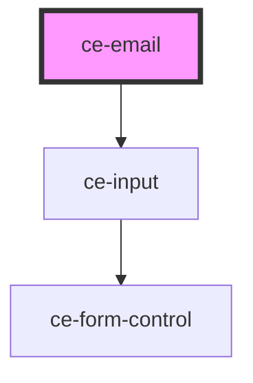

# ce-email

<!-- Auto Generated Below -->

## Properties

| Property          | Attribute     | Description                                                                                                                                                                                                   | Type                             | Default     |
| ----------------- | ------------- | ------------------------------------------------------------------------------------------------------------------------------------------------------------------------------------------------------------- | -------------------------------- | ----------- |
| `autofocus`       | `autofocus`   | The input's autofocus attribute.                                                                                                                                                                              | `boolean`                        | `undefined` |
| `checkoutSession` | --            | (passed from the ce-checkout component automatically)                                                                                                                                                         | `CheckoutSession`                | `undefined` |
| `disabled`        | `disabled`    | Disables the input.                                                                                                                                                                                           | `boolean`                        | `false`     |
| `hasFocus`        | `has-focus`   | Inputs focus                                                                                                                                                                                                  | `boolean`                        | `undefined` |
| `help`            | `help`        | The input's help text.                                                                                                                                                                                        | `string`                         | `''`        |
| `invalid`         | `invalid`     | This will be true when the control is in an invalid state. Validity is determined by props such as `type`, `required`, `minlength`, `maxlength`, and `pattern` using the browser's constraint validation API. | `boolean`                        | `false`     |
| `label`           | `label`       | The input's label.                                                                                                                                                                                            | `string`                         | `undefined` |
| `pill`            | `pill`        | Draws a pill-style input with rounded edges.                                                                                                                                                                  | `boolean`                        | `false`     |
| `placeholder`     | `placeholder` | The input's placeholder text.                                                                                                                                                                                 | `string`                         | `undefined` |
| `readonly`        | `readonly`    | Makes the input readonly.                                                                                                                                                                                     | `boolean`                        | `false`     |
| `required`        | `required`    | Makes the input a required field.                                                                                                                                                                             | `boolean`                        | `false`     |
| `showLabel`       | `show-label`  | Should we show the label                                                                                                                                                                                      | `boolean`                        | `true`      |
| `size`            | `size`        | The input's size.                                                                                                                                                                                             | `"large" \| "medium" \| "small"` | `'medium'`  |
| `value`           | `value`       | The input's value attribute.                                                                                                                                                                                  | `string`                         | `''`        |

## Events

| Event              | Description                                 | Type                              |
| ------------------ | ------------------------------------------- | --------------------------------- |
| `ceBlur`           | Emitted when the control loses focus.       | `CustomEvent<void>`               |
| `ceChange`         | Emitted when the control's value changes.   | `CustomEvent<void>`               |
| `ceClear`          | Emitted when the clear button is activated. | `CustomEvent<void>`               |
| `ceFocus`          | Emitted when the control gains focus.       | `CustomEvent<void>`               |
| `ceInput`          | Emitted when the control receives input.    | `CustomEvent<void>`               |
| `ceUpdateCustomer` |                                             | `CustomEvent<{ email: string; }>` |

## Dependencies

### Depends on

- [ce-input](../../ui/input)

### Graph

----------------------------------------------

*Built with [StencilJS](https://stenciljs.com/)*
