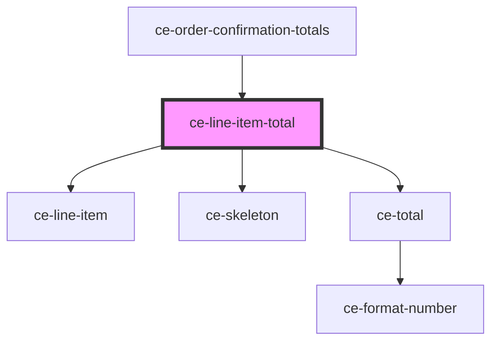

# ce-line-item-total

<!-- Auto Generated Below -->

## Properties

| Property       | Attribute       | Description | Type                    | Default     |
| -------------- | --------------- | ----------- | ----------------------- | ----------- |
| `loading`      | `loading`       |             | `boolean`               | `undefined` |
| `order`        | --              |             | `Order`                 | `undefined` |
| `showCurrency` | `show-currency` |             | `boolean`               | `undefined` |
| `size`         | `size`          |             | `"large" \| "medium"`   | `undefined` |
| `total`        | `total`         |             | `"subtotal" \| "total"` | `'total'`   |

## Dependencies

### Used by

 - [ce-order-confirmation-totals](../order-confirmation-totals)

### Depends on

- [ce-line-item](../../ui/line-item)
- [ce-skeleton](../../ui/skeleton)
- [ce-total](../ce-total)

### Graph

----------------------------------------------

*Built with [StencilJS](https://stenciljs.com/)*
