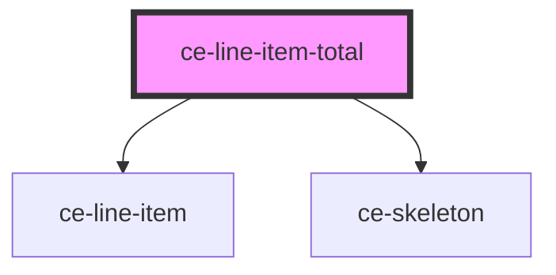

# ce-line-item-total

<!-- Auto Generated Below -->

## Properties

| Property          | Attribute       | Description | Type                  | Default     |
| ----------------- | --------------- | ----------- | --------------------- | ----------- |
| `checkoutSession` | --              |             | `CheckoutSession`     | `undefined` |
| `loading`         | `loading`       |             | `boolean`             | `undefined` |
| `showCurrency`    | `show-currency` |             | `boolean`             | `undefined` |
| `size`            | `size`          |             | `"large" \| "medium"` | `undefined` |
| `total`           | `total`         |             | `string`              | `'total'`   |

## Dependencies

### Depends on

- [ce-line-item](../../ui/line-item)
- [ce-skeleton](../../ui/skeleton)

### Graph

----------------------------------------------

*Built with [StencilJS](https://stenciljs.com/)*
