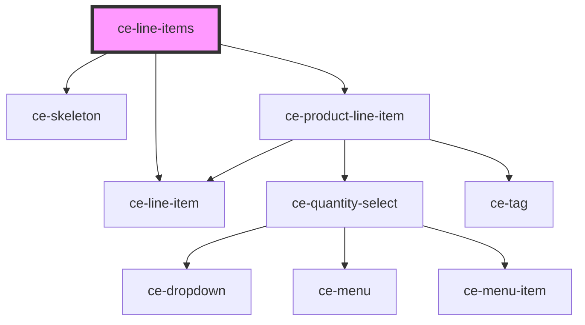

# ce-line-items

<!-- Auto Generated Below -->

## Properties

| Property          | Attribute | Description | Type                                                                                 | Default     |
| ----------------- | --------- | ----------- | ------------------------------------------------------------------------------------ | ----------- |
| `checkoutSession` | --        |             | `CheckoutSession`                                                                    | `undefined` |
| `edit`            | `edit`    |             | `boolean`                                                                            | `true`      |
| `lineItemData`    | --        |             | `LineItemData[]`                                                                     | `undefined` |
| `state`           | `state`   |             | `"draft" \| "failure" \| "finalized" \| "idle" \| "loading" \| "paid" \| "updating"` | `undefined` |

## Events

| Event              | Description | Type                                           |
| ------------------ | ----------- | ---------------------------------------------- |
| `ceUpdateLineItem` |             | `CustomEvent<{ id: string; amount: number; }>` |

## Dependencies

### Depends on

- [ce-line-item](../../ui/line-item)
- [ce-skeleton](../../ui/skeleton)
- [ce-product-line-item](../../ui/product-line-item)

### Graph

----------------------------------------------

*Built with [StencilJS](https://stenciljs.com/)*
