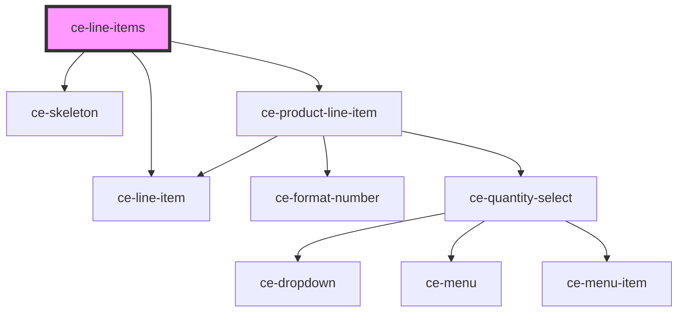

# ce-line-items

<!-- Auto Generated Below -->

## Properties

| Property        | Attribute   | Description | Type                       | Default     |
| --------------- | ----------- | ----------- | -------------------------- | ----------- |
| `editable`      | `editable`  |             | `boolean`                  | `true`      |
| `loading`       | `loading`   |             | `boolean`                  | `undefined` |
| `lockedChoices` | --          |             | `PriceChoice[]`            | `[]`        |
| `order`         | --          |             | `Order`                    | `undefined` |
| `prices`        | --          |             | `{ [id: string]: Price; }` | `undefined` |
| `removable`     | `removable` |             | `boolean`                  | `true`      |

## Events

| Event              | Description           | Type                        |
| ------------------ | --------------------- | --------------------------- |
| `ceRemoveLineItem` | Remove the line item. | `CustomEvent<LineItemData>` |
| `ceUpdateLineItem` | Update the line item. | `CustomEvent<LineItemData>` |

## Dependencies

### Depends on

- [ce-line-item](../../ui/line-item)
- [ce-skeleton](../../ui/skeleton)
- [ce-product-line-item](../../ui/product-line-item)

### Graph

----------------------------------------------

*Built with [StencilJS](https://stenciljs.com/)*
