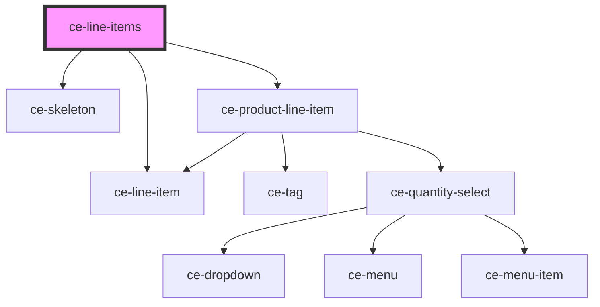

# ce-line-items

<!-- Auto Generated Below -->

## Properties

| Property          | Attribute     | Description | Type              | Default     |
| ----------------- | ------------- | ----------- | ----------------- | ----------- |
| `calculating`     | `calculating` |             | `boolean`         | `false`     |
| `checkoutSession` | --            |             | `CheckoutSession` | `undefined` |
| `lineItemData`    | --            |             | `LineItemData[]`  | `undefined` |
| `loading`         | `loading`     |             | `boolean`         | `undefined` |

## Events

| Event               | Description | Type                          |
| ------------------- | ----------- | ----------------------------- |
| `ceUpdateLineItems` |             | `CustomEvent<LineItemData[]>` |

## Dependencies

### Depends on

- [ce-line-item](../../ui/line-item)
- [ce-skeleton](../../ui/skeleton)
- [ce-product-line-item](../../ui/product-line-item)

### Graph

----------------------------------------------

*Built with [StencilJS](https://stenciljs.com/)*
