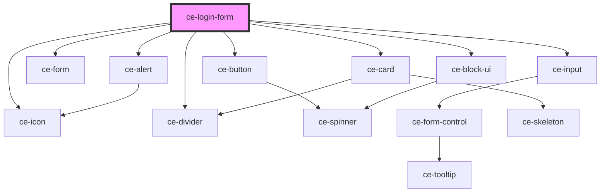

# ce-login-form

<!-- Auto Generated Below -->

## Shadow Parts

| Part      | Description |
| --------- | ----------- |
| `"title"` |             |

## Dependencies

### Depends on

- [ce-alert](../../ui/alert)
- [ce-icon](../../ui/icon)
- [ce-form](../../ui/form)
- [ce-button](../../ui/button)
- [ce-divider](../../ui/divider)
- [ce-input](../../ui/input)
- [ce-card](../../ui/card)
- [ce-block-ui](../../ui/block-ui)

### Graph

----------------------------------------------

*Built with [StencilJS](https://stenciljs.com/)*
