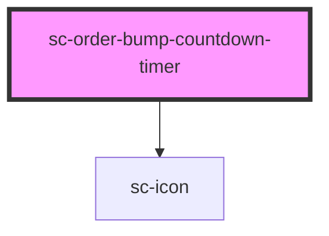

# sc-countdown-timer

<!-- Auto Generated Below -->

## Properties

| Property      | Attribute      | Description                                          | Type      | Default |
| ------------- | -------------- | ---------------------------------------------------- | --------- | ------- |
| `redirectUrl` | `redirect-url` | The URL to redirect to when the countdown completes. | `string`  | `'/'`   |
| `showIcon`    | `show-icon`    | Whether to show the icon.                            | `boolean` | `true`  |

## Dependencies

### Depends on

- [sc-icon](../../../ui/icon)

### Graph

----------------------------------------------

*Built with [StencilJS](https://stenciljs.com/)*
