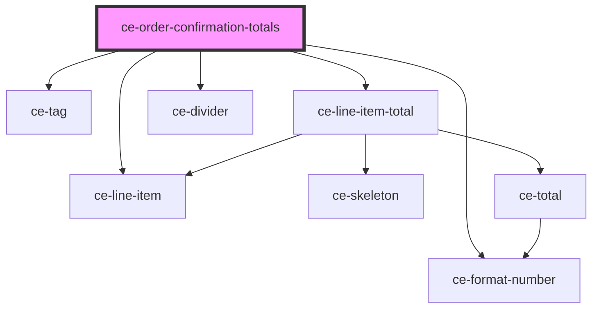

# ce-order-confirmation-totals

<!-- Auto Generated Below -->

## Properties

| Property          | Attribute | Description | Type              | Default     |
| ----------------- | --------- | ----------- | ----------------- | ----------- |
| `order` | --        |             | `Order` | `undefined` |

## Dependencies

### Depends on

- [ce-line-item](../../ui/line-item)
- [ce-tag](../../ui/tag)
- [ce-format-number](../../util/format-number)
- [ce-line-item-total](../line-item-total)
- [ce-divider](../../ui/divider)

### Graph

----------------------------------------------

*Built with [StencilJS](https://stenciljs.com/)*
