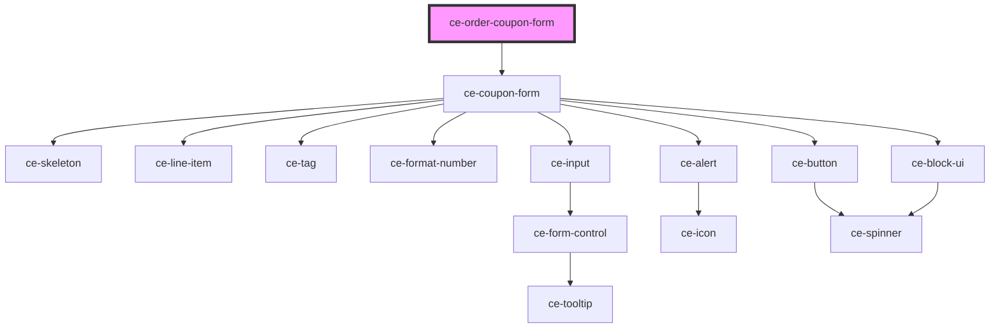

# ce-coupon-form

<!-- Auto Generated Below -->

## Properties

| Property    | Attribute    | Description | Type      | Default     |
| ----------- | ------------ | ----------- | --------- | ----------- |
| `busy`      | `busy`       |             | `boolean` | `undefined` |
| `error`     | `error`      |             | `any`     | `undefined` |
| `forceOpen` | `force-open` |             | `boolean` | `undefined` |
| `label`     | `label`      |             | `string`  | `undefined` |
| `loading`   | `loading`    |             | `boolean` | `undefined` |
| `order`     | --           |             | `Order`   | `undefined` |

## Events

| Event           | Description | Type                  |
| --------------- | ----------- | --------------------- |
| `ceApplyCoupon` |             | `CustomEvent<string>` |

## Dependencies

### Depends on

- [ce-coupon-form](../../ui/coupon-form)

### Graph

----------------------------------------------

*Built with [StencilJS](https://stenciljs.com/)*
