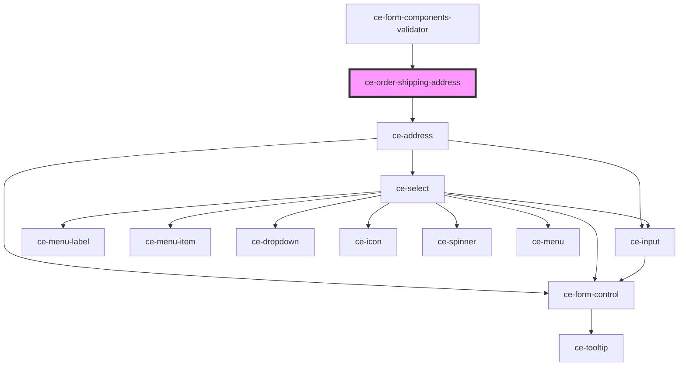

# ce-order-shipping-address

<!-- Auto Generated Below -->

## Properties

| Property                  | Attribute  | Description                           | Type      | Default     |
| ------------------------- | ---------- | ------------------------------------- | --------- | ----------- |
| `customerShippingAddress` | --         | Holds the customer's shipping address | `Address` | `undefined` |
| `label`                   | `label`    | Label for the field.                  | `string`  | `undefined` |
| `loading`                 | `loading`  | Is this loading.                      | `boolean` | `undefined` |
| `required`                | `required` | Is this required (defaults to true)   | `boolean` | `true`      |
| `shippingAddress`         | --         | Holds the customer's billing address  | `Address` | `undefined` |

## Dependencies

### Used by

 - [ce-form-components-validator](../../providers/form-components-validator)

### Depends on

- [ce-address](../../ui/address)

### Graph

----------------------------------------------

*Built with [StencilJS](https://stenciljs.com/)*
