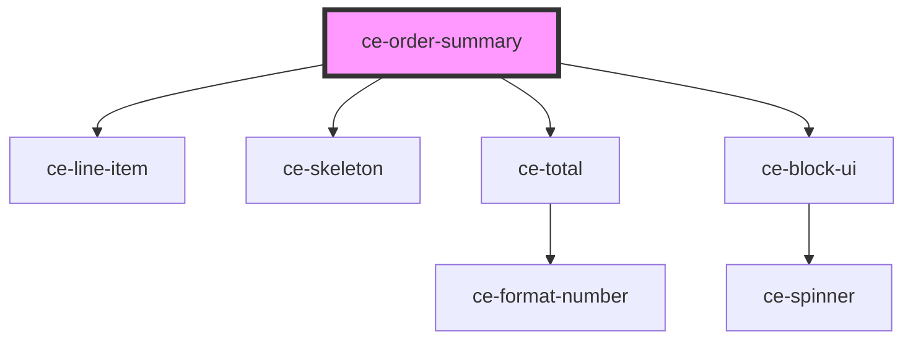

# ce-order-summary

<!-- Auto Generated Below -->

## Properties

| Property      | Attribute     | Description | Type      | Default     |
| ------------- | ------------- | ----------- | --------- | ----------- |
| `busy`        | `busy`        |             | `boolean` | `undefined` |
| `collapsed`   | `collapsed`   |             | `boolean` | `undefined` |
| `collapsible` | `collapsible` |             | `boolean` | `false`     |
| `empty`       | `empty`       |             | `boolean` | `undefined` |
| `loading`     | `loading`     |             | `boolean` | `undefined` |
| `order`       | --            |             | `Order`   | `undefined` |

## Dependencies

### Depends on

- [ce-line-item](../../ui/line-item)
- [ce-skeleton](../../ui/skeleton)
- [ce-total](../ce-total)
- [ce-block-ui](../../ui/block-ui)

### Graph

----------------------------------------------

*Built with [StencilJS](https://stenciljs.com/)*
